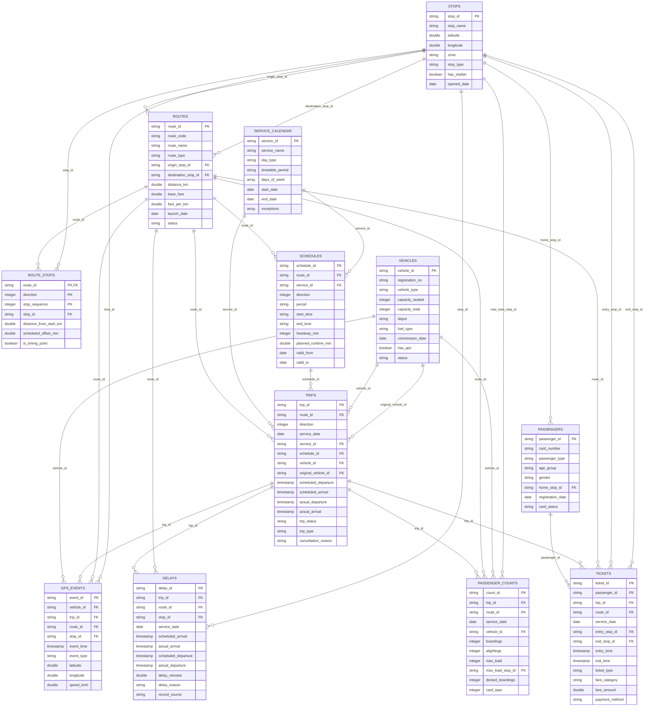

# Entity-Relationship Diagram - UrbanTransit IQ

_Generated from the PK/FK definitions in `documentation/schemas/*.json`._

Reading guide: `||--o{` means *one* row on the left relates to *zero or more* rows on the right (Laravel: `hasMany` / `belongsTo`).

## How the tables fit together

- **Network (reference) tables:** `stops`, `routes`, `route_stops` (ordered stops per route and direction), `vehicles`, `passengers`.
- **Planning tables:** `service_calendar` (which days a timetable runs) and `schedules` (headways and planned running times per route, direction, service and period).
- **Operations (event) tables:** `trips` (each planned journey, with scheduled vs actual times and vehicle), and four tables derived from the same trip simulation: `passenger_counts` (APC loads), `tickets` (card tap-in/tap-out), `delays` (stop-level deviations with reasons) and `gps_events` (vehicle positions).
